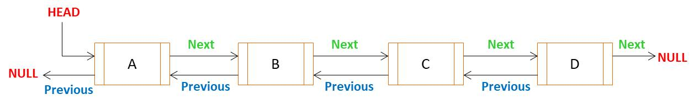
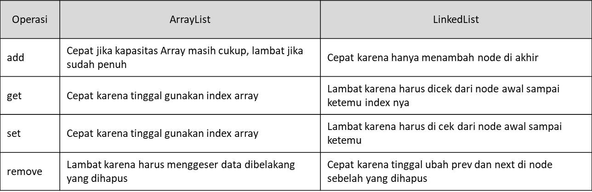

# LinkedList Class

- LinkedList adalah `implementasi List` dengan struktur data `Double Linked List`

    

# Perbedaan ArrayList dan LinkedList

- Berikut perbedaannya:

  

# Catatan Tambahan

- Datanya akan disimpan dalam bentuk Node 
- tiap node mempunyai pointer `Next` dan `Previous`, 
- fungsi pointer untuk beralih (berpindah) antar Node 
- didalam LinkedList tidak menyimpan informasi berkaitan dengan Array, seperti index
- jadi untuk mengambil data di dalam linked list tidak bisa menggunakan index 
- LinkedList akan lambat saat mengambil datanya, karena dia akan cek satu persatu 
- Intinya LinkedList akan menyimpan data dalam bentuk Node, satu node diisi satu data, dan saling terhubung antar node 
- index awal akan diisi data paling awal masuk dan seterusnya